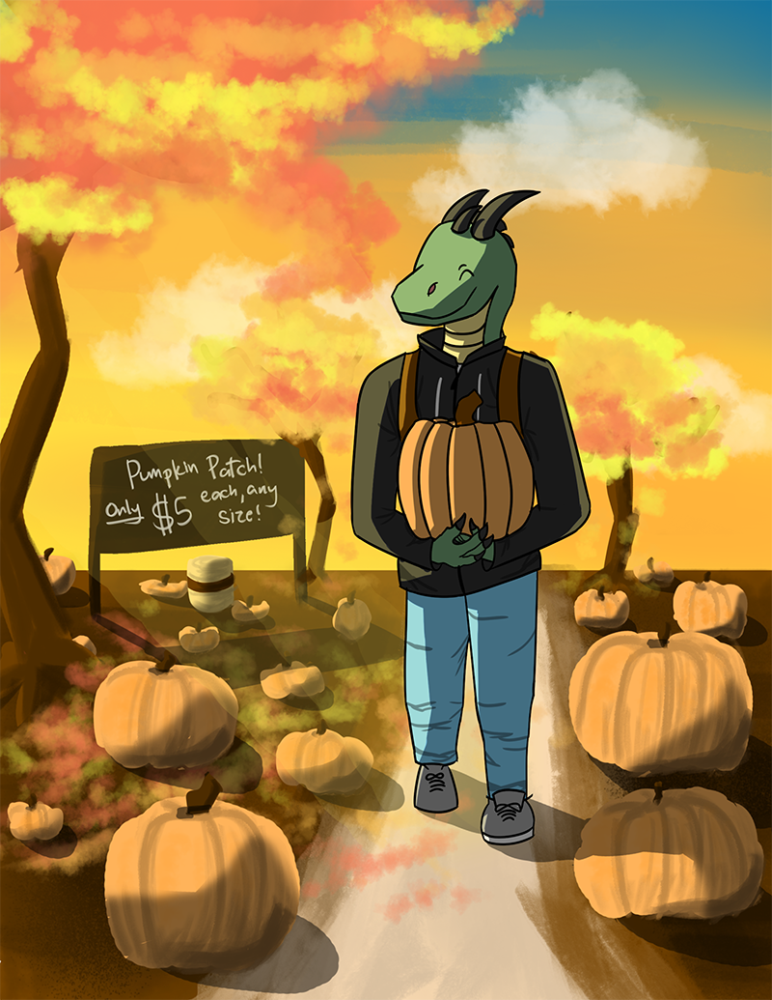
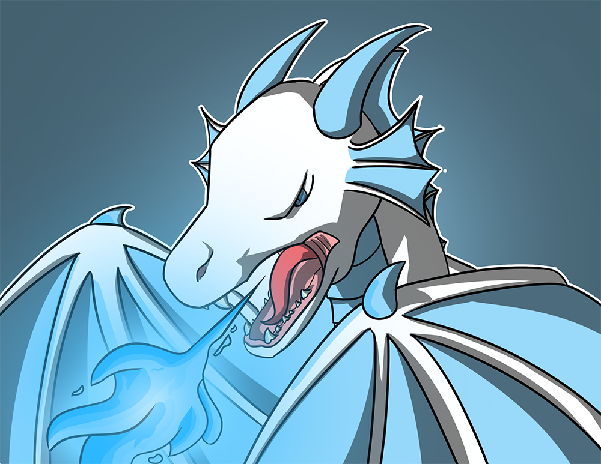

# The Journey from Nothing to Something

Three months ago, I was bored in quarantine and decided to pick up drawing. What I didn't know is that this would turn out to be a way to express my ideas onto a digital canvas as well as a way I could possibly earn money.

Funny enough, what motivated me to start this little experiment was that I got a 70% on an english project, which I drew. Of course, the art wasn't a big part of it, but I couldn't help but believe that it did contribute to that dissapointing grade. So, I got working.

## Dragons! I really like drawing dragons for some apparent reason. Here are some cool firey boys!

## Here are some other random art pieces too! 

I still have a **ton** more art, but I don't like sharing it (not that they're inherently bad, I just like keeping my art private!)

## Now, I didn't spend a fortune on drawing courses. Everything here was done using an online course called Drawabox. You can find their website below.

[Drawabox (This is an entirely FREE course! It is quite challenging but is worth the time and effort!](https://drawabox.com/)

- Bulleted
- List

1. Numbered
2. List

**Bold** and _Italic_ and `Code` text

[Link](url) and 
