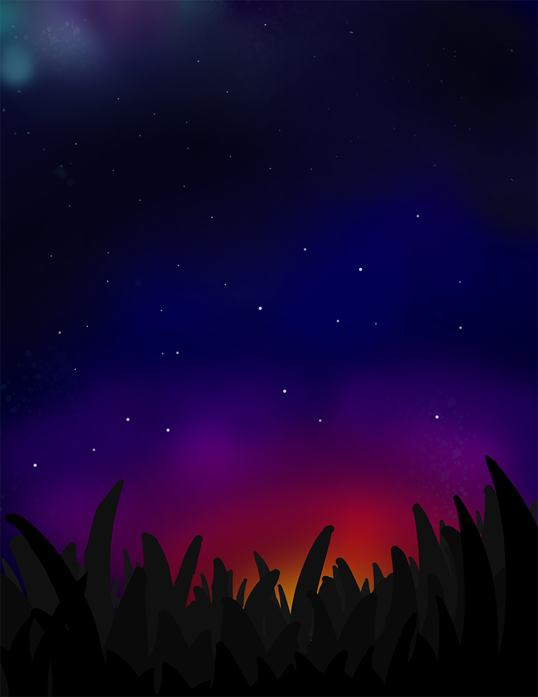

# The Journey from Nothing to Something

Three months ago, I was bored in quarantine and decided to pick up drawing. What I didn't know is that this would turn out to be a way to express my creativity, emotions, and thoughts onto a digital canvas as well as a way I could possibly earn money. 

Funny enough, what motivated me to start this little experiment was that I got a 70% on an english project, which I drew. Of course, the art wasn't a big part of it, as it was english class, but I couldn't help but believe that it did contribute to that dissapointing grade. I always wanted to draw as well as I really like webcomics and such, so, I got working.

What you see below are a select few results from the three months I have started drawing, some drawn when I first started and some drawn very recently!

## Here are some random art pieces! 

I still have a **ton** more art, but I don't like sharing most of it (not that they're inherently bad (some of my art is absolutely garbage and some are absolutely beautiful) I just like keeping my art private!)

## Now, I didn't spend a fortune on drawing courses. Everything here was done using a FREE online course called Drawabox. You can find their website below.

[**Drawabox** (This is an entirely FREE course! It is quite challenging but is worth the time and effort!](https://drawabox.com/)

This course teaches you the following things:
- Proper Linework
- Perspective
- Construction
- Developing an idea of 3D Space
- And much, much more!

I comepletely reccommend this course to anyone who wants to pick up drawing! It IS challenging, there are some lessons which I totally bombed, but it is a great learning experience. 

	✏️	✏️	✏️	✏️	✏️	✏️	✏️	✏️	✏️	✏️	✏️	✏️	✏️
